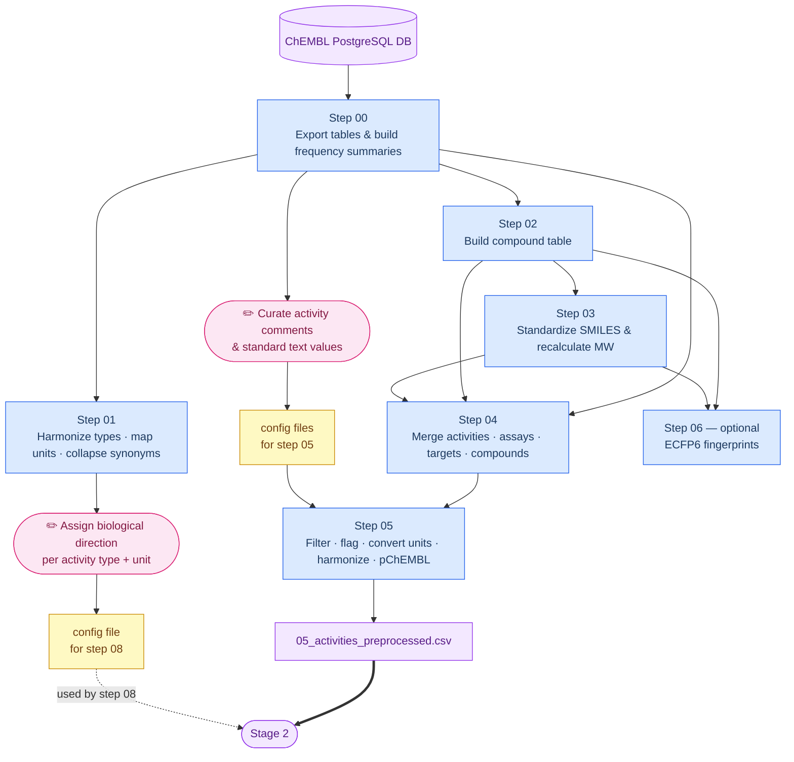

# Scripts

Two sequential stages: **Stage 1** processes the full ChEMBL database once; **Stage 2** runs per pathogen to produce ML-ready datasets.

## Setup

Create a local ChEMBL PostgreSQL database following `docs/install_ChEMBL.md`. Database connection defaults are in `src/default.py` (`DATABASE_NAME`, user, password).

---

## Stage 1 — Process ChEMBL (run once, ~4–5 h)

```sh
conda activate camt
bash scripts/process_ChEMBL.sh              # standard
bash scripts/process_ChEMBL.sh --calculate_ecfps  # also compute fingerprints
```

| Step | Script | What it does | Key output |
|------|--------|-------------|------------|
| 00 | `00_export_chembl_activities.py` | Exports raw tables from the ChEMBL PostgreSQL DB and derives frequency tables for activity comments, units, and text values. | `data/chembl_activities/*.csv` |
| 01 | `01_prepare_manual_files.py` | Harmonizes activity type strings, maps units to UCUM, collapses synonyms. **Pauses here** — a curator must assign biological direction to each (activity\_type, unit) pair before continuing (see below). | `data/chembl_processed/01_*.csv` |
| 02 | `02_get_compound_info.py` | Merges compound structures with molecule dictionary; calculates molecular weight. | `data/chembl_processed/02_compound_info.csv` |
| 03 | `03_standardize_compounds.py` | Canonicalizes SMILES, removes salts/solvents, recalculates MW. ⏳ ~3–4 h | `data/chembl_processed/03_compound_info_standardized.csv` |
| 04 | `04_merge_activity_and_compounds.py` | Joins activities, assays, targets, and compounds into a single table. | `data/chembl_processed/04_activities_all_raw.csv` |
| 05 | `05_clean_activities.py` | Filters invalid entries, applies activity comment/text flags, converts units, harmonizes activity types, calculates pChEMBL from converted uM values. ⏳ ~15 min | `data/chembl_processed/05_activities_preprocessed.csv`, `data/chembl_processed/05_activity_std_units_curated_comments.csv` |
| 06 | `06_calculate_ecfps.py` *(optional)* | Computes ECFP6 fingerprints (radius 3, 2048 bits) for all standardized compounds. ⏳ ~15 min | `data/chembl_processed/06_chembl_ecfps.h5` |

### Manual curation required before running `process_ChEMBL.sh`

`config/activity_std_units_manual_curation.csv` is technically only consumed by step 08, but `process_ChEMBL.sh` checks for it upfront and exits early if it is missing — before the long-running steps 03–05 — to avoid a multi-hour run ending in a preventable error.

1. Open `data/chembl_processed/01_activity_std_units_converted.csv`
2. Fill in `manual_curation_direction`: `1` = higher value → more active, `-1` = lower value → more active, `0` = unclear
3. Save as `config/activity_std_units_manual_curation.csv`

### Config files used in Stage 1

| File | Step | Purpose |
|------|------|---------|
| `config/ucum_manual.csv` | 01, 05 | Maps ChEMBL units to UCUM; provides value conversion formulas |
| `config/synonyms.csv` | 01, 05 | Collapses activity type variants to canonical names |
| `config/activity_comments_manual_curation.csv` | 05 | Maps activity comment strings to active/inactive/unknown |
| `config/standard_text_manual_curation.csv` | 05 | Maps standard text values to active/inactive/unknown |

---

### Step 00 — Export ChEMBL activities (`00_export_chembl_activities.py`)

Exports the following raw tables from the local ChEMBL PostgreSQL database into `data/chembl_activities/`:

- `activities.csv`, `assays.csv`, `assay_parameters.csv`, `activity_stds_lookup.csv`
- `bioassay_ontology.csv`, `compound_structures.csv`, `docs.csv`
- `molecule_dictionary.csv`, `target_dictionary.csv`
- `target_components.csv`, `component_synonyms.csv`, `component_sequences.csv`, `source.csv`

For details on table contents see the [ChEMBL schema documentation](https://ftp.ebi.ac.uk/pub/databases/chembl/ChEMBLdb/latest/schema_documentation.txt).

In addition, the script derives four frequency tables from the `ACTIVITIES` table and two reference tables from `ASSAYS` and `TARGET_DICTIONARY`, all saved to `data/chembl_processed/`:

1. `00_activity_comments.csv` — frequency of values in `activity_comment` (e.g. `"active"`)
2. `00_activity_std_units.csv` — frequency of (`standard_type`, `standard_units`) pairs (e.g. `"IC50 / nM"`)
3. `00_standard_units.csv` — frequency of `standard_units` values
4. `00_standard_text.csv` — frequency of values in `standard_text_value` (e.g. `"Compound metabolized"`)
5. `00_assay_descriptions.csv` — assay IDs mapped to their text descriptions and ChEMBL IDs (from `ASSAYS`)
6. `00_target_dictionary_synonyms.csv` — target dictionary with all component synonyms collapsed into a semicolon-separated `synonyms` column (used by step 09)

The files `00_activity_comments.csv` and `00_standard_text.csv` were manually reviewed to assign an activity label to the most frequent entries, stored in `config/activity_comments_manual_curation.csv` and `config/standard_text_manual_curation.csv` (column `manual_curation_activity`): `1` = active, `-1` = inactive, `0` = inconclusive.

---

### Step 01 — Prepare manual curation files (`01_prepare_manual_files.py`)

Harmonizes activity type strings (uppercase, punctuation stripped) and maps units to their UCUM-compliant equivalents via `ucum_manual.csv`. Synonym activity types are collapsed using `synonyms.csv`. Produces two outputs in `data/chembl_processed/`:

- `01_activity_std_units_converted.csv` — (`activity_type`, `unit`) pairs with counts, ready for manual curation of biological direction
- `01_harmonized_types_map.csv` — each harmonized activity type mapped to the count and list of raw `standard_type` variants it collapses

> ⚠️ **Manual curation required before running `process_ChEMBL.sh`.** Fill in the `manual_curation_direction` column of `01_activity_std_units_converted.csv` and save the result as `config/activity_std_units_manual_curation.csv`. The file is consumed by step 08, but `process_ChEMBL.sh` checks for it before step 02 to avoid a failed run after several hours of processing.

---

### Step 02 — Get compound info (`02_get_compound_info.py`)

Merges `compound_structures.csv` with `molecule_dictionary.csv` to map each `molregno` to its `chembl_id`. Calculates molecular weight from `canonical_smiles`. Output: `data/chembl_processed/02_compound_info.csv`.

---

### Step 03 — Standardize compounds (`03_standardize_compounds.py`)

Standardizes compound structures using the ChEMBL structure pipeline: canonicalizes SMILES, removes salts and solvents, and extracts the parent molecule. Molecular weight is recalculated from the standardized structure. Output: `data/chembl_processed/03_compound_info_standardized.csv`.

⏳ ETA: ~3–4 hours (main bottleneck of the pipeline).

---

### Step 04 — Merge activity and compounds (`04_merge_activity_and_compounds.py`)

Joins activity records with assay metadata, target information, and standardized compound data into a single unified table. Each row represents one experimental measurement with its associated compound, assay, and target fields. Output: `data/chembl_processed/04_activities_all_raw.csv`.

---

### Step 05 — Clean activities (`05_clean_activities.py`)

Produces the final preprocessed activity table `data/chembl_processed/05_activities_preprocessed.csv`. Performs the following steps:

1. **Filter invalid entries** — removes activities with missing canonical SMILES.
2. **Flag activity comments** — maps each `activity_comment` to active (1), inactive (-1), or unknown (0) using `config/activity_comments_manual_curation.csv`.
3. **Flag standard text** — same for `standard_text_value` using `config/standard_text_manual_curation.csv`.
4. **Convert units and values** — normalizes unit strings and converts raw values using formulas from `config/ucum_manual.csv`.
5. **Standardize relations** — maps `>=`, `>>`, `~` etc. to simplified `>`, `<`, `=`; missing (`NaN`) relations are treated as exact measurements (`=`).
6. **Calculate pChEMBL** — adds a `pchembl_calculated` column for records with `unit = umol.L-1` and a valid numeric value; zero concentrations are replaced with 1e-10 before the log transform, and the result is clipped to [1, 9]. The original ChEMBL-provided `pchembl` column is retained alongside it.
7. **Convert doc IDs** — replaces internal `doc_id` with `doc_chembl_id`.
8. **Harmonize activity types** — strips punctuation/spaces and uppercases `standard_type`.
9. **Map synonyms** — collapses activity type variants to their canonical name using `config/synonyms.csv`.
10. **Create text flag** — merges activity comment and standard text flags into a single `text_flag` column (1 / -1 / 0).

Also saves `data/chembl_processed/05_activity_std_units_curated_comments.csv`: a per-(`activity_type`, `unit`) summary of total counts and text-flagged records.

⏳ ETA: ~15 minutes.

---

### Step 06 — Calculate ECFPs (`06_calculate_ecfps.py`) *(optional)*

Computes ECFP6 fingerprints (radius 3, 2048 bits) for all standardized compounds using RDKit. Failed SMILES are skipped. Results are stored in HDF5 format. Output: `data/chembl_processed/06_chembl_ecfps.h5`.

⏳ ETA: ~15 minutes.

---

### Stage 1 — Data flow diagram



---

## Stage 2 — Generate pathogen datasets (run per pathogen)

```sh
conda activate camt
bash scripts/generate_datasets.sh --<pathogen_code>
# e.g. bash scripts/generate_datasets.sh --mtb
```

Supported codes are in `config/pathogens.csv`. All outputs go to `output/<pathogen_code>/`.

| Step | Script | What it does | Key output |
|------|--------|-------------|------------|
| 07 | `07_get_pathogen_assays.py` | Filters the full ChEMBL dataset to records matching the pathogen (by organism field and optional assay allowlist). ⏳ ~1 min | `07_chembl_raw_data.csv.gz`, `07_assays_raw.csv` |
| 08 | `08_clean_pathogen_activities.py` | Removes invalid records, assigns biological direction per (activity\_type, unit) pair, drops unmodelable activities. ⏳ ~5 min | `08_chembl_cleaned_data.csv.gz`, `08_assays_cleaned.csv` |
| 09 | `09_curate_assay_parameters.py` | **⚠️ GPU + ollama required.** Uses a local LLM to extract and standardize biological context for each unique assay: target type/name/ChEMBL ID, strain, ATCC ID, mutations, drug resistances, culture media. Processes assays in batches of 6. Already-processed assays are skipped on restart. Target ChEMBL IDs are resolved via a multi-strategy exact-match lookup (organism-prefix stripping, slash-split, gene-name reconstruction) — IDs are never guessed. | `09_assays_parameters_full.csv` |
| 10 | `10_calculate_assay_clusters.py` | Clusters compounds in each assay by ECFP4 similarity (BitBirch) at three Tanimoto thresholds (0.3, 0.6, 0.85). **Can run in parallel with step 09.** ⏳ ~10 min | `10_assays_clusters.csv` |
| 11 | `11_get_assay_overlap.py` | Computes pairwise compound overlap between assays with ≥ 50 compounds. ⏳ ~1 min | `11_assays_overlap.csv` |
| 12 | `12_prepare_assay_datasets.py` | Binarizes activities using expert cutoffs (`config/expert_cutoffs.csv`). Produces quantitative (`_qt`), qualitative (`_ql`), and mixed (`_mx`) datasets per assay. **⚠️ `expert_cutoffs.csv` must exist before running.** ⏳ ~5 min | `12_datasets.csv`, `12_datasets/datasets_qt.zip`, `12_datasets/datasets_ql.zip`, `12_datasets/datasets_mx.zip` |
| 13 | `13_lightmodel_individual.py` | Trains Random Forest classifiers (4-fold CV, Morgan fingerprints) on each binarized dataset. Evaluates AUROC. Adds ChEMBL decoys for active-enriched datasets. ⏳ ~30 min | `13_individual_LM.csv`, `13_reference_set.csv.gz`, `13_correlations/A/`, `13_correlations/B/` |
| 14 | `14_select_datasets_individual.py` | Selects the best cutoff per assay (AUROC > 0.7 threshold; prefers the mid cutoff). ⏳ < 1 min | `14_individual_selected_LM.csv` |
| 15 | `15_lightmodel_merged.py` | Merges assays that share experimental context (same activity type, unit, target, strain) and re-evaluates modelability for assays rejected in step 14. ⏳ ~10–30 min | `15_merged_LM.csv`, `13_correlations/M/`, `12_datasets/M/` |
| 16 | `16_select_datasets_merged.py` | Selects the best cutoff per merged group (same criteria as step 14). ⏳ < 1 min | `16_merged_selected_LM.csv` |
| 17 | `17_evaluate_correlations.py` | Computes pairwise similarity between all selected ORGANISM datasets using reference-set predictions, then greedily deduplicates redundant models. ⏳ ~5 min | `17_dataset_correlations.csv`, `17_final_datasets.csv` |
| 18 | `18_prepare_assay_master.py` | Assembles a master annotation table merging all per-step metadata, pipeline status flags, and selection traceability fields for every assay triplet. ⏳ < 1 min | `18_assays_master.csv` |
| 19 | `19_prepare_final_datasets.py` *(optional)* | Exports the selected datasets as simplified CSVs (SMILES + binary label only) in a single ZIP. ⏳ < 1 min | `19_final_datasets.zip` |
| 20 | `20_diagnosis.py` *(optional)* | Produces a diagnostic plot covering data quality, chemical diversity, assay coverage, and model correlations. ⏳ ~2 min | `20_diagnosis.png` |

### Config files used in Stage 2

| File | Step | Purpose |
|------|------|---------|
| `config/assays/<pathogen_code>.csv` | 07 | Manual assay allowlist — ChEMBL assay IDs to include regardless of organism matching (one ID per line, no header). Optional: missing file is treated as an empty list. |
| `config/activity_std_units_manual_curation.csv` | 08 | Biological direction per (activity\_type, unit) pair |
| `config/expert_cutoffs.csv` | 12 | Binarization thresholds per (activity\_type, unit, target\_type, pathogen\_code) |
| `config/pathogens.csv` | all | Pathogen codes and names |

---

### Step 07 — Get pathogen assays (`07_get_pathogen_assays.py`)

Filters the full preprocessed ChEMBL dataset to extract all bioactivity records associated with the target pathogen. Matching is done by case-insensitive text search on `target_organism` and `assay_organism`. Additionally, any assay ChEMBL IDs listed in `config/assays/<pathogen_code>.csv` are included regardless of organism match — this allowlist is intended for assays that the organism-name filter misses (e.g. assays annotated under a strain name or a non-standard organism string). The file contains one ChEMBL assay ID per line with no header; if the file does not exist it is silently ignored.

Outputs are saved to `output/<pathogen_code>/`:

| File | Description |
|------|-------------|
| `07_chembl_raw_data.csv.gz` | All activity records matching the pathogen. |
| `07_target_organism_counts.csv` | Frequency table of `target_organism` values. |
| `07_compound_counts.csv.gz` | Unique compounds with InChIKey, SMILES, and activity count. |
| `07_all_smiles.csv` | Deduplicated list of SMILES observed for the pathogen (single `smiles` column). Note: different `compound_chembl_id` values can share the same SMILES after step 03 standardization (e.g. the same molecule registered multiple times, or salt forms that collapse to the same canonical structure). This file provides the unique SMILES space and is intended as a convenience reference, for example for virtual screening or external model evaluation. |
| `07_assays_raw.csv` | Per-(`assay_id`, `activity_type`, `unit`) summary with compound counts, text flags, and fraction of pathogen chemical space. |

⏳ ETA: ~1 minute.

---

### Step 08 — Clean pathogen activities (`08_clean_pathogen_activities.py`)

Applies sequential filters to the raw pathogen data and assigns biological direction per (`activity_type`, `unit`) pair. Activities are kept only if they have a valid direction or an active/inactive text flag.

Filters applied in order:

1. **Remove compounds with no SMILES** — activities without a valid structure are discarded.
2. **Remove empty activities** — activities lacking both a numeric value and a non-zero `text_flag` are discarded.
3. **Filter by consensus units** — only activities with units present in `data/chembl_processed/01_activity_std_units_converted.csv` (or no unit) are retained.
4. **Assign direction** — biological direction (-1, 0, or +1) is assigned per (`activity_type`, `unit`) from `config/activity_std_units_manual_curation.csv`. A value of 0 indicates an unclear direction.
5. **Remove unmodelable activities** — activities with no direction or unclear direction (0) and no active/inactive text flag are discarded.

Outputs are saved to `output/<pathogen_code>/`:

| File | Description |
|------|-------------|
| `08_chembl_cleaned_data.csv.gz` | Cleaned activity records for the pathogen. |
| `08_activity_type_unit_comments.csv` | Per-(`activity_type`, `unit`) counts, cumulative proportion, text flag summary, and assigned direction. |
| `08_assays_cleaned.csv` | Same structure as `07_assays_raw.csv` with an added `direction` column, built on the cleaned data. |

⏳ ETA: ~5 minutes.

---

### Step 09 — Curate assay parameters (`09_curate_assay_parameters.py`)

> ⚠️ **Requires a GPU-enabled machine with [ollama](https://ollama.com/) running locally.**

Uses a local LLM to extract and standardize biological context for each (`assay_id`, `activity_type`, `unit`) triplet in `08_assays_cleaned.csv`. Assays are processed in batches of 6. For each batch, a prompt is built from ChEMBL assay fields (`data/chembl_activities/assays.csv`), publication metadata (`data/chembl_activities/docs.csv`), detailed assay descriptions (`data/chembl_processed/00_assay_descriptions.csv`), and a target dictionary with synonyms (`data/chembl_processed/00_target_dictionary_synonyms.csv`). The model returns a strict JSON with the following fields:

| Field | Description |
|-------|-------------|
| `assay_organism_curated` | Biological species where the assay is actually performed (e.g. `Mycobacterium tuberculosis` for growth assays; `Homo sapiens` for cytotoxicity assays in human cell lines) |
| `target_type_curated` | Curated target type: `SINGLE PROTEIN`, `ORGANISM`, `DISCARDED`, `SUBCELLULAR`, or the verbatim ChEMBL target type |
| `target_name_curated` | Target name extracted from assay annotations or inferred from context |
| `target_chembl_id_curated` | Resolved target ChEMBL ID (see resolution strategy below) |
| `assay_strain_curated` | Biological strain name only (e.g. `H37Rv`); catalog identifiers excluded |
| `atcc_id` | ATCC identifier, formatted as `ATCC <number>` |
| `mutations` | Explicit mutations in one-letter format (e.g. `S450L`) |
| `known_drug_resistances` | Drugs for which resistance is explicitly stated |
| `culture_media` | Growth or culture medium explicitly stated |

#### Two-track processing: Group A and Group B

Assays are classified into two groups before any LLM call, based on how much inference is required:

**Group A (text extraction only)** — assays where the ChEMBL target type is already reliable: `SINGLE PROTEIN`, `PROTEIN COMPLEX`, `PROTEIN FAMILY`, `SUBCELLULAR`, or known non-biological types (`ADMET`, `NUCLEIC-ACID`, `TISSUE`, `SELECTIVITY GROUP`, `UNDEFINED`, `UNKNOWN`), as well as assays annotated as `ORGANISM` or organism-based BAO format where the assay organism matches the pathogen. For these assays, `target_type_curated`, `target_name_curated`, and `target_chembl_id_curated` are **pre-filled deterministically** from ChEMBL without LLM inference, as follows:

| ChEMBL target type | `target_type_curated` | `target_chembl_id_curated` |
|---|---|---|
| `SINGLE PROTEIN` / `PROTEIN COMPLEX` / `PROTEIN FAMILY` | kept as-is | taken directly from ChEMBL |
| `SUBCELLULAR` | `SUBCELLULAR` | taken directly from ChEMBL |
| `ADMET`, `NUCLEIC-ACID`, `TISSUE`, `SELECTIVITY GROUP`, `UNDEFINED`, `UNKNOWN` | `DISCARDED` | cleared |
| `ORGANISM` or ambiguous + organism-based BAO matching pathogen | `ORGANISM` | set from hardcoded per-pathogen mapping (see below) |

The LLM is then called only to extract text-based fields: `assay_organism_curated`, `assay_strain_curated`, `atcc_id`, `mutations`, `known_drug_resistances`, `culture_media`.

Exception: assays with a known protein target type but `target_chembl_id = CHEMBL612545` (a ChEMBL sentinel for "Unchecked") bypass Group A and go to Group B for full inference.

**Group B (full inference)** — assays with ambiguous target types: `UNCHECKED` (CHEMBL612545), `NON-MOLECULAR`, or `NON-PROTEIN TARGET`. The LLM infers all fields, guided by the following rules embedded in the prompt:

- If assay organism matches the pathogen **and** assay appears phenotypic or growth-based → `target_type_curated = ORGANISM`
- If description mentions a specific protein name → `target_type_curated = SINGLE PROTEIN`; `target_chembl_id_curated` is left empty and resolved automatically in Python (see below)
- If assay organism is a human cell line (e.g. cytotoxicity) → `assay_organism_curated = Homo sapiens`, not the pathogen
- If `assay_type = Binding` and target is `UNCHECKED` → `target_type_curated` can only be `SINGLE PROTEIN` or `DISCARDED`, never `ORGANISM`
- `target_type_curated = DISCARDED` if: (a) the assay is explicitly not a bioactivity assay (e.g. transcriptomics), or (b) both a target name/ID and an organism/cell-line are absent from all annotations

#### Hardcoded organism ChEMBL ID mapping

Each supported pathogen has a hardcoded ORGANISM-level ChEMBL ID used in Group A pre-filling and injected into Group B prompts:

| Pathogen | ChEMBL ID |
|----------|-----------|
| Mycobacterium tuberculosis | CHEMBL360 |
| Acinetobacter baumannii | CHEMBL614425 |
| Escherichia coli | CHEMBL354 |
| Pseudomonas aeruginosa | CHEMBL348 |
| Klebsiella pneumoniae | CHEMBL350 |
| Streptococcus pneumoniae | CHEMBL347 |
| Enterococcus faecium | CHEMBL357 |
| Candida albicans | CHEMBL366 |
| Plasmodium falciparum | CHEMBL364 |
| Campylobacter | CHEMBL612492 |
| Helicobacter pylori | CHEMBL612600 |
| Neisseria gonorrhoeae | CHEMBL614430 |
| Enterobacter | CHEMBL614439 |
| Staphylococcus aureus | CHEMBL352 |
| Schistosoma mansoni | CHEMBL612893 |

#### Target ChEMBL ID resolution (SINGLE PROTEIN assays)

For SINGLE PROTEIN assays in Group B, the LLM extracts the protein name and leaves `target_chembl_id_curated` empty. The ID is then resolved in Python against the ChEMBL target dictionary using a **multi-strategy exact-match lookup**: (1) direct case-insensitive match, (2) organism-prefix stripping, (3) slash-split of the full name, (4) organism-prefix stripping followed by slash-split, (5) GyrA/B-style gene-name reconstruction (short second part after slash expands using the prefix of the first part), (6) token-level slash split (for compound names like `"DNA GyrA/B heterotetramer"`). IDs are never guessed — unresolvable names are left blank.

The script supports **resuming**: results are appended incrementally to an intermediate file (`09_assays_parameters.csv`) as batches complete; already-processed triplets are skipped on restart. This intermediate file is deleted automatically once all triplets are processed and merged into `09_assays_parameters_full.csv`. On LLM failure, an empty row is written and processing continues.

The LLM model is configured via `LLM_MODEL` in `src/default.py`.

Outputs are saved to `output/<pathogen_code>/`:

| File | Description |
|------|-------------|
| `09_assays_parameters_full.csv` | Final merged output with curated parameters for all (`assay_id`, `activity_type`, `unit`) triplets. Used by steps 12 and 18. |

⏳ ETA: ~5 seconds per assay on a GPU-enabled machine.

---

### Step 10 — Calculate assay clusters (`10_calculate_assay_clusters.py`)

For each (`assay_id`, `activity_type`, `unit`) triplet in `08_assays_cleaned.csv`, unique compound SMILES are retrieved from the cleaned activity data and clustered using ECFP4 fingerprints (2048 bits) with the BitBirch algorithm. The number of clusters is computed at three Tanimoto Coefficient thresholds (0.3, 0.6, 0.85), providing a measure of chemical diversity within each assay.

Steps 09 and 10 are **independent** and can be run in parallel after step 08.

Outputs are saved to `output/<pathogen_code>/`:

| File | Description |
|------|-------------|
| `10_assays_clusters.csv` | Number of clusters per (`assay_id`, `activity_type`, `unit`) at each Tanimoto threshold. |

⏳ ETA: ~10 minutes.

---

### Step 11 — Get assay overlap (`11_get_assay_overlap.py`)

Computes pairwise compound overlap between assays in the cleaned pathogen dataset. Each assay is treated as an independent (`assay_id`, `activity_type`, `unit`) triplet. Only assays with 50 or more compounds are considered. For each pair, the number of shared compounds, an overlap ratio (shared compounds divided by the size of the smaller assay, so 1.0 means the smaller assay is fully contained in the larger), and whether both assays originate from the same publication are calculated.

Outputs are saved to `output/<pathogen_code>/`:

| File | Description |
|------|-------------|
| `11_assays_overlap.csv` | Pairwise assay overlap table with compound counts, shared compounds, overlap ratio, and same-document flag. |

⏳ ETA: ~1 minute.

---

### Step 12 — Prepare assay datasets (`12_prepare_assay_datasets.py`)

Produces binarized, ML-ready compound-level datasets for each (`assay_id`, `activity_type`, `unit`) triplet. Requires the outputs of steps 08 and 09.

Each assay is processed through two independent paths — **quantitative** (numeric values) and **qualitative** (text-based activity flags). The result is classified as exactly one dataset type per (`assay_id`, `activity_type`, `unit`, `expert_cutoff`) combination, depending on what data is available: `quantitative`, `qualitative`, or `mixed` (both). If multiple expert cutoffs are defined for an assay, one dataset is produced per cutoff, all of the same type.

#### Target type curation

The LLM-curated `target_type_curated` from step 09 is merged onto the cleaned assay table and then post-processed into a simplified `target_type_curated_extra` field, constrained to one of three values:

- `SINGLE PROTEIN` — also captures `PROTEIN COMPLEX` and `PROTEIN FAMILY`
- `ORGANISM` — whole-cell or phenotypic assays
- `DISCARDED` — assays that cannot be assigned a clear biological target

The collapse rules applied on top of the LLM output are: `UNCHECKED` (raw ChEMBL) accepts ORGANISM, SINGLE PROTEIN, or DISCARDED from the LLM, anything else is overridden to DISCARDED; `NON-MOLECULAR` accepts only ORGANISM or DISCARDED (SINGLE PROTEIN is overridden to DISCARDED); `SUBCELLULAR` and all other types not listed above collapse to DISCARDED.

This simplified field is used as the key for expert cutoff lookup.

#### Expert cutoffs

Binarization thresholds are loaded from `config/expert_cutoffs.csv`, keyed by (`activity_type`, `unit`, `target_type_curated_extra`, `pathogen_code`). Multiple cutoffs per key are supported (semicolon-separated), generating one dataset per cutoff value. If no cutoff is defined for an assay, quantitative binarization is skipped.

> ⚠️ `expert_cutoffs.csv` must be manually created before running this step. Cutoffs are defined in the canonical unit space produced by step 05 (e.g. IC50 in `umol.L-1`). Because all values are normalized to a single unit per activity type in step 05, separate entries for nM, µM etc. are not needed.

#### Quantitative binarization

For assays with numeric values, a valid biological direction, and an expert cutoff:

1. **Adjust censored relations** — measurements on the wrong side of the direction (e.g. `IC50 > 100 µM` when lower = more active) are replaced with the assay extreme value and their relation set to `=`. This ensures they are correctly classified as inactive after binarization without distorting the compound selection step.
2. **Disambiguate compounds** — if a compound has multiple measurements, the most active one is kept: minimum for direction = −1, maximum for direction = +1.
3. **Binarize** — values are compared to the expert cutoff: `bin = 1` if `value ≤ cutoff` (direction = −1) or `value ≥ cutoff` (direction = +1).

#### Qualitative binarization

Built from the `text_flag` column (derived from activity comments and standard text values in step 05). Aggregated to compound level:
- If a compound has conflicting labels (both active and inactive), a `ValueError` is raised.
- Label priority: `1 > −1 > 0`. Compounds with only neutral flags (0) are removed.

#### Dataset types

| Type | Condition | File suffix |
|------|-----------|-------------|
| `quantitative` | Numeric values + valid direction + expert cutoff, no qualitative data | `_qt_<cutoff>.csv.gz` |
| `qualitative` | Text flags only, or no cutoff/direction available | `_ql.csv.gz` |
| `mixed` | Both quantitative and qualitative data available | `_mx_<cutoff>.csv.gz` |
| `none` | Quantitative data exists but no cutoff or direction; no qualitative data | — |

For **mixed** datasets, qualitative inactives not already present in the quantitative set are appended to it. Only inactives are added this way — qualitative actives without a numeric measurement are excluded to avoid inflating the active class with unquantified data.

Outputs are saved to `output/<pathogen_code>/`:

| File | Description |
|------|-------------|
| `12_datasets.csv` | One row per (assay, cutoff) — dataset type, compound counts, positive counts, ratios. |
| `12_assay_data_info.csv` | One row per assay — dataset type, relation counts (`=`, `<`, `>`), value distribution percentiles. |
| `12_datasets/datasets_qt.zip` | All quantitative dataset files. |
| `12_datasets/datasets_ql.zip` | All qualitative dataset files. |
| `12_datasets/datasets_mx.zip` | All mixed dataset files. |

⏳ ETA: ~5 minutes.

---

### Step 13 — Individual light modeling (`13_lightmodel_individual.py`)

Evaluates the modelability of each binarized assay dataset from step 12 using Random Forest classifiers trained on Morgan (ECFP) fingerprints. Produces per-assay AUROC scores and reference set predictions used for downstream correlation analysis.

#### Modeling conditions

Datasets are evaluated under two independent conditions that differ in size requirements and class balance strategy:

| | Condition A | Condition B |
|--|-------------|-------------|
| Dataset types | quantitative or mixed | quantitative or mixed |
| Min compounds (`cpds_qt`) | ≥ 1,000 | any |
| Min actives (`pos_qt`) | ≥ 50 | ≥ 100 |
| Active ratio (`ratio_qt`) | 0.001–< 0.5 | ≥ 0.5 |
| Decoys added | No | Yes |
| Purpose | Large, balanced datasets | Active-enriched datasets, decoy-balanced |

All thresholds are evaluated on the **quantitative portion** of the dataset (`cpds_qt`, `pos_qt`, `ratio_qt`), not on the full compound count. For mixed datasets this means qualitative-only compounds do not count towards the size or balance thresholds.

Conditions A and B are **mutually exclusive**: condition A requires an active ratio strictly below 0.5, condition B requires ≥ 0.5, so a dataset at exactly 0.5 goes to B. Assignment is determined hierarchically by checking **all available expert cutoffs**: an assay is assigned to condition A if *any* of its cutoffs produces a dataset meeting condition A criteria; only assays that fail condition A at every cutoff are then considered for condition B (again across all cutoffs). This means a dataset can qualify for A even if the middle cutoff alone would not pass the size or balance thresholds.

#### Condition B decoy strategy

For datasets where actives are over-represented (ratio ≥ 0.5), random ChEMBL compounds that have **never been tested against the pathogen** are added as decoys until the active ratio reaches 10% (`decoy_ratio = 0.1`). This prevents the model from learning a biased baseline while keeping the active set intact.

#### Per-assay workflow

For each qualifying dataset:
1. Load the quantitative or mixed dataset from the step 12 zip archives
2. *(Condition B only)* Sample and append decoys from the pathogen-naive ChEMBL pool
3. **Downsample negatives** if the active ratio is below 5%, to avoid extreme class imbalance during training. Applied to both conditions after any decoy addition.
4. Run **4-fold stratified cross-validation** with Random Forest (100 trees) → mean AUROC ± std
5. Train a **final model on all data** → predict activity probabilities on the reference set

#### Reference set

The reference set is a fixed sample of up to **10,000 compounds that have never been screened against the pathogen**, drawn from all ChEMBL compounds with available fingerprints. If fewer than 10,000 pathogen-naive compounds exist in ChEMBL, all available compounds are used. Using pathogen-naive compounds avoids data leakage: correlations between model predictions reflect shared biological signal rather than shared training data. The set is sampled with a fixed seed (42) for reproducibility.

> The alternative of using pathogen-tested compounds was considered but rejected: many of those compounds appear in the training sets of the models being compared, which would make correlations partly reflect memorization rather than generalization.

Outputs are saved to `output/<pathogen_code>/`:

| File | Description |
|------|-------------|
| `13_individual_LM.csv` | One row per (assay, cutoff, condition) — AUROC mean and std, dataset metadata. |
| `13_reference_set.csv.gz` | The pathogen-naive reference compounds (up to 10,000). |
| `13_correlations/A/` | Reference set prediction probabilities (`.npz`) for condition A models. |
| `13_correlations/B/` | Reference set prediction probabilities (`.npz`) for condition B models. |

⏳ ETA: ~30 minutes.

---

### Step 14 — Select individual datasets (`14_select_datasets_individual.py`)

Selects the single best dataset per assay triplet from the step 13 results, applying an AUROC threshold and a cutoff preference rule.

#### Selection criteria

Only assays with a best AUROC > 0.7 (across all cutoffs tested) are retained. For assays with multiple expert cutoffs, one cutoff is chosen per the following rule:

- **Prefer the mid cutoff** (the second value in the `expert_cutoffs.csv` list for that assay) as a default, since it represents the central activity threshold and is more interpretable.
- **Switch to the best cutoff** if the best cutoff achieves an AUROC more than 0.1 higher than the mid cutoff — indicating a meaningfully better model at that threshold.
- **Fall back to the best cutoff** if the mid cutoff has no modeled result in `13_individual_LM.csv` (e.g. it was filtered out before modeling).

> ⚠️ Assays with fewer than two expert cutoffs defined are skipped at this step and will not appear in the output.

The AUROC minimum threshold (0.7) and improvement threshold (0.1) are configurable via `AUROC_MIN_THRESHOLD` and `AUROC_IMPROVEMENT_THRESHOLD` in `src/default.py`.

The flag `is_mid_cutoff` records whether the mid cutoff was used (`True`) or the best cutoff was selected instead (`False`).

#### Per-label independence

Selection is performed independently for conditions A and B. Because step 13 uses hierarchical assignment, each assay triplet appears under exactly one label in the input — so the same triplet cannot appear in both A and B outputs.

Outputs are saved to `output/<pathogen_code>/`:

| File | Description |
|------|-------------|
| `14_individual_selected_LM.csv` | Selected datasets with cutoff, AUROC, and dataset statistics. |

⏳ ETA: < 1 minute.

---

### Step 15 — Merged light modeling (`15_lightmodel_merged.py`)

Attempts to rescue assay triplets that were not accepted in step 14 by merging them into larger combined datasets and re-evaluating their modelability.

Many assays in ChEMBL are too small individually to meet the compound and positive thresholds of conditions A or B. However, assays that share the same experimental context (activity type, unit, direction, assay type, and target type) can be combined into a single dataset. If the union of their compounds is large enough, a viable classifier can still be built.

#### Merge candidate identification

Assay triplets that were **not** accepted in step 14 are grouped by shared experimental metadata. Only quantitative and mixed assays can contribute data to merged models. Two grouping strategies are applied independently:

- **ORGANISM** — whole-cell / phenotypic assay merges. Assays are split into two sub-groups before merging:
  - *Strain-known*: groups by (`activity_type`, `unit`, `direction`, `assay_type`, `target_type_curated_extra`, `assay_strain_curated`).
  - *NaN-strain*: groups by (`activity_type`, `unit`, `direction`, `assay_type`, `target_type_curated_extra`) — strain is absent and not used as a grouping key.
- **SINGLE PROTEIN** — groups by (`activity_type`, `unit`, `direction`, `assay_type`, `target_type_curated_extra`, `bao_label`, `assay_strain_curated`, `target_chembl_id`). Ensures that only assays against the same protein target are combined. Assays without a curated `target_chembl_id` are excluded from merging.

A group passes the **pre-filter** if it contains at least 2 assays and the union of their compounds is ≥ 100. Groups are ranked by union size.

#### Fractional contribution filter

Before modeling, each group is further filtered to remove assays that contribute too little unique data. An assay must account for at least **5% of the group's total compound union** to be included (pass 1). Assays that fail this threshold are not simply discarded — they are re-evaluated among themselves as a **rescue pass** (pass 2): if the rejected assays collectively form a group of ≥ 2 assays where each contributes ≥ 5% of the rescue-group union, they are modeled as an independent sub-group. Rescue-pass datasets receive an `_r` suffix in their name. If both passes produce viable sub-groups, both are modeled independently.

#### Merging and binarization

For each qualifying group (or sub-group) and each applicable expert cutoff:

1. Quantitative and mixed datasets for all member assays are loaded from the step 12 zip archives and concatenated.
2. Across the merged quantitative records, **the most active measurement is kept per compound** (min for direction = −1, max for direction = +1).
3. Qualitative inactives from mixed datasets are appended, with compound-level deduplication (existing records take priority).
4. A **post-merge compound threshold** is applied: ≥ 1,000 compounds if the active ratio is < 0.5 (balanced case); ≥ 100 compounds if the active ratio is ≥ 0.5 (enriched case, decoys will be added). Groups that fall below the threshold are skipped.
5. Groups with ≤ 50 positives after merging are skipped.

#### Decoy strategy

If the active ratio in the merged dataset exceeds 50%, random ChEMBL decoys (pathogen-naive compounds) are added until the ratio reaches 10% — the same strategy as condition B in step 13.

#### Per-group workflow

For each qualifying group:
1. Build the merged dataset as described above
2. *(If active ratio > 0.5)* Sample and append decoys
3. **Downsample negatives** if the active ratio is below 5%, to avoid extreme class imbalance during training
4. Run **4-fold stratified cross-validation** with Random Forest → mean AUROC ± std
5. Train a **final model on all data** → predict activity probabilities on the reference set (loaded from `13_reference_set.csv.gz`)
6. Save merged dataset (without decoys) and reference predictions

Merged datasets are named `M_ORG<i>` (ORGANISM) or `M_SP<i>` (SINGLE PROTEIN), with an optional `_r` suffix for rescue-pass sub-groups, followed by the expert cutoff value (e.g. `M_ORG0_10.0`, `M_SP1_r_1.0`).

Outputs are saved to `output/<pathogen_code>/`:

| File | Description |
|------|-------------|
| `15_merged_LM.csv` | One row per merged group × cutoff — AUROC, compound counts, assay keys, metadata. |
| `15_merging_analysis.csv` | One row per assay attempted — merge outcome and failure reason (used by step 18). |
| `13_correlations/M/` | Reference set prediction probabilities (`.npz`) for each merged model. |
| `12_datasets/M/` | Merged dataset files (`.csv.gz`), one per group × cutoff, without decoys. |

⏳ ETA: ~10–30 minutes depending on the number of qualifying groups.

---

### Step 16 — Select merged datasets (`16_select_datasets_merged.py`)

Selects the single best dataset per merged group from the step 15 results, applying the same AUROC threshold and mid-cutoff preference rule used in step 14 for individual datasets.

Each group is identified by its base name (the dataset name with the cutoff suffix stripped — e.g. `M_ORG0_1.0` → `M_ORG0`). Rescue-pass groups (`M_ORG0_r`) are treated as independent groups from their main-pass counterparts (`M_ORG0`) and each gets its own selection slot.

#### Selection criteria

Only merged groups with a best AUROC > 0.7 (across all cutoffs tested) are retained. For groups with multiple expert cutoffs, one cutoff is chosen per the following rule:

- **Prefer the mid cutoff** (the second value in the `expert_cutoffs.csv` list) as a default, since it represents the central activity threshold and is more interpretable.
- **Switch to the best cutoff** only if the best cutoff achieves an AUROC more than 0.1 higher than the mid cutoff — indicating a meaningfully better model at that threshold.
- **Fall back to the best cutoff** if the mid cutoff has no modeled result (NaN AUROC).

> Unlike step 14, groups with fewer than two expert cutoffs are not skipped — the best (only) cutoff is used directly.

The AUROC minimum threshold and improvement threshold are configurable via `AUROC_MIN_THRESHOLD` and `AUROC_IMPROVEMENT_THRESHOLD` in `src/default.py`.

The flag `is_mid_cutoff` records which rule was applied for each selected dataset.

#### Coverage tracking

Coverage is computed by reading compound IDs directly from the saved merged dataset files in `12_datasets/M/`, excluding decoy rows. Coverage is reported before and after selection, separately for ORGANISM and SINGLE PROTEIN groups.

Outputs are saved to `output/<pathogen_code>/`:

| File | Description |
|------|-------------|
| `16_merged_selected_LM.csv` | Selected merged datasets with cutoff, AUROC, and group metadata. |

⏳ ETA: < 1 minute.

---

### Step 17 — Evaluate dataset correlations (`17_evaluate_correlations.py`)

Evaluates pairwise similarity between all selected ORGANISM datasets (individual A/B from step 14 and merged M from step 16), then applies a greedy deduplication to select a non-redundant final set.

#### Why only ORGANISM assays?

Phenotypic whole-organism assays are the primary endpoint of interest for antimicrobial drug discovery. SINGLE PROTEIN datasets are modeled in earlier steps but excluded from the final selection here. They remain accessible via the master table (step 18) with their pipeline status annotated.

#### Similarity metrics

Similarity between any two models is measured using their predictions on the **reference set** — 10,000 pathogen-naive compounds saved in step 13. Three complementary metrics are computed:

| Metric | Description |
|--------|-------------|
| `spearman` | Rank correlation of predicted probabilities across all 10,000 reference compounds. |
| `hit_overlap_1000` | Normalised overlap of the top-1,000 predictions above chance (broad hit agreement). |
| `hit_overlap_100` | Normalised overlap of the top-100 predictions above chance (high-confidence hit agreement). |
| `compound_overlap` | Fraction of training compounds shared between the two datasets (Jaccard-like, normalised by the smaller set). |

All scores are computed as a full **N×N matrix** — every ordered pair is stored, including self-pairs (diagonal) and both directions of each pair. All metrics are symmetric, so the two directions of a given pair carry identical values. The file has N² rows for N datasets. This is intentional: it keeps the greedy deduplication lookup simple and avoids the need to try both orderings on every query.

Results are saved to `17_dataset_correlations.csv`.

#### Greedy deduplication

Datasets are sorted by **label first** (A → B → M), then by size descending within each label, and processed greedily: a dataset is discarded if it is simultaneously **model-correlated** and **compound-overlapping** with an already-selected dataset. This means individual condition A datasets are always prioritized over condition B, which are always prioritized over merged M datasets, regardless of size.

```
(spearman + hit_overlap_1000 + hit_overlap_100) / 3 > CORRELATION_THRESHOLD
AND compound_overlap > CORRELATION_THRESHOLD
```

The threshold (default 0.5) is configurable via `CORRELATION_THRESHOLD` in `src/default.py`.

Using `AND` means that high model correlation alone is not enough to discard a dataset — there must also be substantial compound overlap. Two models that are highly correlated but trained on different compounds may be capturing the same biology across different chemical series, which is informative rather than redundant.

Outputs are saved to `output/<pathogen_code>/`:

| File | Description |
|------|-------------|
| `17_dataset_correlations.csv` | N×N similarity scores between all selected ORGANISM datasets (all ordered pairs, including self-pairs). |
| `17_final_datasets.csv` | All ORGANISM datasets with a `selected` flag indicating which passed deduplication. |

⏳ ETA: ~5 minutes (scales quadratically with the number of datasets).

---

### Step 18 — Prepare assay master table (`18_prepare_assay_master.py`)

Assembles a comprehensive per-assay annotation table that integrates all metadata and pipeline status flags across every step. This is the primary reference output for understanding what happened to each assay in the pipeline.

#### Contents

The master table contains one row per (`assay_id`, `activity_type`, `unit`) triplet and merges the following sources:

| Source file | Fields added |
|-------------|--------------|
| `08_assays_cleaned.csv` | Base assay metadata: assay type, target, direction, compound counts, text flags |
| `09_assays_parameters_full.csv` | LLM-curated fields: organism, target type, strain, ATCC ID, mutations, media |
| `10_assays_clusters.csv` | Chemical diversity: cluster counts at Tanimoto 0.3, 0.6, 0.85 |
| `12_assay_data_info.csv` | Dataset type, relation counts, activity value distribution (percentiles) |
| `12_datasets.csv` | Active ratios per dataset type: `ratio_qt` (semicolon-separated per cutoff), `ratio_ql`, `ratio_mx` |
| `config/expert_cutoffs.csv` | `evaluated_cutoffs` — semicolon-separated cutoffs tested for each assay |
| `13_individual_LM.csv` | `evaluated_aurocs` — per-cutoff AUROC values aligned to `evaluated_cutoffs`; `NaN` if not modeled |
| `15_merging_analysis.csv` | Failure reasons for assays that could not be merged (used to generate M comments) |
| `data/chembl_activities/` | `uniprot_accession` — UniProt accession(s) for the curated target |
| `config/pubchem_aids/<pathogen>.csv` *(optional)* | `pubchem` — PubChem AID for the assay, if available |

Pipeline results from steps 13–17 (`13_individual_LM.csv`, `14_individual_selected_LM.csv`, `15_merged_LM.csv`, `15_merging_analysis.csv`, `16_merged_selected_LM.csv`, `17_final_datasets.csv`, `17_dataset_correlations.csv`) are loaded to populate the pipeline status and final selection columns.

Three additional columns record the final selection outcome:

- `selected` — boolean, whether the assay is part of the final non-redundant dataset set
- `selected_cutoff` — the expert cutoff used in the selected dataset
- `selected_label` — the condition label (A, B, or merged group name) under which the assay was selected

#### Pipeline status annotations

Three `comment_A`, `comment_B`, `comment_M` columns annotate each assay's journey through the pipeline under conditions A, B, and M respectively. Each is a free-text string explaining the outcome at that stage:

| Outcome | Example comment |
|---------|----------------|
| Not considered for modeling | `"Not considered for A: insufficient compounds (47, need ≥1000) at middle cutoff (1.0)"` |
| Modeled but failed AUROC threshold | `"Modeled but not selected: best AUROC 0.623 below 0.70 threshold"` |
| Selected, excluded from step 17 (SINGLE PROTEIN only) | `"Selected but excluded from correlation analysis (non-ORGANISM target type)"` |
| Selected, discarded as redundant | `"Discarded: high correlation with dataset M_ORG0_1.0"` |
| Retained in final selection | `"Retained in final selection"` |

For condition M, comments also include the merged group name (e.g. `"Retained in final selection from group M_ORG0_r"`). Failure reasons for non-merged assays are derived from `15_merging_analysis.csv` and include specific counts (e.g. `"Not modeled: insufficient compounds after merging (83 compounds, need >1000)"`). The middle cutoff (second value in the expert cutoffs list) is used as the reference when diagnosing A/B pre-modeling failures, since hierarchical assignment is based on that cutoff.

Outputs are saved to `output/<pathogen_code>/`:

| File | Description |
|------|-------------|
| `18_assays_master.csv` | One row per assay triplet with all metadata and pipeline status columns. |

⏳ ETA: < 1 minute.

---

### Step 19 — Prepare final datasets (`19_prepare_final_datasets.py`) *(optional)*

Exports all selected datasets as simplified CSVs containing only SMILES and binary activity labels, bundled into a single ZIP file. Intended for researchers who want ML-ready data without navigating the full pipeline outputs.

Reads `17_final_datasets.csv` (`selected == True`) and looks up each dataset file by its original pipeline name. Individual datasets are sourced from `datasets_qt.zip`, `datasets_ql.zip`, and `datasets_mx.zip`; merged datasets from the `12_datasets/M/` directory. Exported files contain only `smiles` and `bin` — decoys are not present (individual dataset files never include them; merged datasets have decoys stripped at save time in step 15).

Before export, each dataset is **deduplicated on SMILES**: if two different `compound_chembl_id` values share the same canonical SMILES (possible after step 03 standardization), only one row is kept — the active instance (`bin = 1`) takes priority over an inactive (`bin = 0`).

#### Inputs

| File | Description |
|------|-------------|
| `17_final_datasets.csv` | Selected dataset names and metadata |
| `12_datasets/datasets_qt.zip`, `12_datasets/datasets_mx.zip` | Individual quantitative and mixed dataset files |
| `12_datasets/M/*.csv.gz` | Merged dataset files |

#### Outputs

Saved to `output/<pathogen_code>/`:

| File | Description |
|------|-------------|
| `19_final_datasets.zip` | One CSV per selected dataset, containing only `smiles` and `bin` columns, named by original pipeline dataset name. |
| `19_final_datasets_metadata.csv` | One row per exported dataset — `original_name`, `activity_type`, `unit`, `target_type`, `cutoff`, `auroc`, `cpds` (actual row count), `positives`, `label`, and `source` (`individual` or `merged`). |

⏳ ETA: < 1 minute.
---

### Step 20 — General organism-level model (`20_general_model.py`) *(optional)*

Builds one pooled ML model per `(activity_type, unit)` pair by combining **all** ORGANISM-target assays at the middle expert cutoff. Unlike steps 13–16 (which model individual assays or merged groups), this step ignores assay boundaries and trains on the full available chemical space for each measurement type.

Only `target_type_curated_extra == "ORGANISM"` assays with quantitative or mixed dataset types are used. SINGLE PROTEIN assays are excluded.

#### Algorithm

For each `(activity_type, unit)` pair:

1. Select all assay rows at the middle expert cutoff (second in the expert cutoffs list, or first if only one is defined).
2. Load the corresponding dataset files, concatenate all compounds, and apply two rounds of deduplication:
   - **By `compound_chembl_id`**: one row per compound ID, with the active label winning (`bin = 1`) if the compound appears in multiple assays.
   - **By SMILES**: one row per canonical SMILES string, again with the active label winning. This second pass removes residual duplicates arising from different `compound_chembl_id` values that share the same SMILES after step 03 standardization (e.g. the same molecule registered multiple times).
3. Skip the pair only if there are no actives.
4. If there are no inactives, or if active ratio > 0.5, add random ChEMBL decoys at `DECOY_RATIO` (same logic as condition B in step 13).
5. Downsample negatives if active ratio < 5% (same logic as step 13).
6. Run 4-fold cross-validation (`KFoldTrain`) and report AUROC if `n_actives > 10`; otherwise AUROC is recorded as `NaN`. The dataset is always saved regardless. No reference set predictions are saved (no deduplication step follows).

#### Inputs

| File | Description |
|------|-------------|
| `12_datasets.csv` | Assay-cutoff metadata (dataset type, target type) |
| `12_datasets/datasets_qt.zip`, `12_datasets/datasets_mx.zip` | Individual quantitative and mixed dataset files |
| `data/chembl_processed/06_chembl_ecfps.h5` | Morgan fingerprints for all ChEMBL compounds |
| `07_compound_counts.csv.gz` | Pathogen compound set (used to build decoy pool) |

#### Outputs

Saved to `output/<pathogen_code>/`:

| File | Description |
|------|-------------|
| `20_general_model.csv` | One row per modeled `(activity_type, unit)` pair — cutoff, assay count, compound count, active count, AUROC ± std. |
| `12_datasets/20_general_datasets.zip` | One CSV per modeled pair containing `compound_chembl_id`, `smiles`, and `bin` columns (no decoys). |

⏳ ETA: a few minutes (one RF model per activity/unit pair).

---

### Step 21 — Diagnosis (`21_diagnosis.py`)

Produces a multi-panel diagnostic figure summarising data quality, chemical diversity, assay coverage, and model correlations for the pathogen. The figure layout adapts to pipeline progress: a **2×2 grid** (4 panels) is produced when no datasets have been selected yet (steps 13–17 not yet run), and a **3×3 grid** (9 panels) when at least one dataset has been selected.

#### Input files

| File | Used for |
|------|----------|
| `07_chembl_raw_data.csv.gz` | Raw activity and compound counts |
| `07_assays_raw.csv` | Raw assay count |
| `07_compound_counts.csv.gz` | Full pathogen compound set (denominator for coverage) |
| `08_chembl_cleaned_data.csv.gz` | Cleaned activity counts, compound-per-assay mapping |
| `08_assays_cleaned.csv` | Cleaned assay count, assay type / target type / unit distributions |
| `09_assays_parameters_full.csv` | Strain distribution |
| `12_datasets.csv` | Assay-cutoff metadata (summary table) |
| `13_individual_LM.csv` | Individual model results (summary table) |
| `14_individual_selected_LM.csv` | Individual selected datasets (summary table) |
| `15_merged_LM.csv` | Merged model results (summary table) |
| `15_merging_analysis.csv` | Merging failure reasons (summary table) |
| `16_merged_selected_LM.csv` | Merged selected datasets (summary table) |
| `17_final_datasets.csv` | Selected dataset names, labels, compound counts |
| `17_dataset_correlations.csv` | Pairwise compound overlap and hit overlap between models |
| `18_assays_master.csv` | Per-assay pipeline status comments (rejection analysis) |
| `20_general_model.csv` *(optional)* | General organism model results (summary table) |
| `data/chembl_processed/06_chembl_ecfps.h5` | Morgan fingerprints for tSNE |

#### Panels

**Panel 1 — Raw vs cleaned data**
Grouped bar chart comparing activities, compounds, and assays before and after the cleaning pipeline (steps 07–08). Gray = raw, blue = cleaned.

**Panel 2 — Data classification**
Five stacked fraction bars showing how assays and activities are distributed across categories:
- *Assay type*: functional (F), binding (B), other
- *Target type*: organism (ORG), single protein (SP), other
- *Strain*: majoritarian strain, other strains, no strain
- *Unit*: µM (`umol.L-1`), percentage (`%`), other
- *Activity type*: quantitative-only, quantitative+qualitative mixed, other

**Panel 3 — tSNE**
2D tSNE embedding of Morgan fingerprints. Up to 10,000 pathogen-tested compounds are shown colored by local density (yellow = dense, purple = sparse); 3× as many randomly sampled background ChEMBL compounds are shown in light gray. Uses PCA (16 components) as a pre-processing step before tSNE.

**Panel 4 — Chemical space coverage by assay**
Dual-axis log–log plot showing, as assays are added in order: the number of compounds per assay (yellow, left axis) and the cumulative fraction of the pathogen chemical space covered (purple, right axis). Allows assessment of how quickly coverage saturates and how unevenly compounds are distributed across assays.

> The following panels are only produced when at least one dataset has been selected (steps 13–17 completed).

**Panel 5 — Compound overlap heatmap**
Square heatmap of pairwise compound overlap between all selected ORGANISM models, hierarchically clustered by compound overlap distance. Colorbar is fixed to [0, 1]. High values indicate models trained on largely overlapping compound sets.

**Panel 6 — Top-100 hit overlap heatmap**
Same layout as panel 5 but showing normalised hit overlap in the top-100 reference set predictions. Colorbar is fixed to [0, 1]. High values indicate models that agree on which compounds are most likely to be active.

**Panel 7 — Chemical space coverage by label**
Bar chart showing the fraction of the pathogen chemical space covered by the final selected datasets, broken down by condition label (A, B, M) and combined (ALL).

**Panel 8 — Compounds vs positives per selected dataset**
Log–log scatter of total compounds vs active compounds for each selected dataset, colored by label (A = orange, B = blue, M = yellow). Allows quick assessment of dataset sizes and class balance.

**Panel 9 — Assay rejection reasons**
Stacked bar chart showing, for each condition label (A, B, M), the proportion of all **assay triplets** (one per `assay_id` × `activity_type` × `unit` combination) falling into each pipeline status category. Each assay triplet is assigned to exactly one category (first match in priority order), so the bars always sum to 1.

| Category | Meaning |
|----------|---------|
| `selected` | Retained in final selection |
| `already_accepted` | Accepted under a prior condition (hierarchical) |
| `non_organism` | SINGLE PROTEIN — excluded from correlation analysis |
| `qualitative_only` | Only qualitative data — quantitative required |
| `no_activity_data` | No activity data available |
| `no_cutoff` | No expert cutoff defined |
| `too_few_compounds` | Fewer than 1,000 compounds |
| `too_few_positives` | Insufficient actives at all evaluated cutoffs |
| `ratio_out_of_range` | Active ratio outside the required range |
| `middle_cutoff_failure` | Middle cutoff produces too few actives or wrong ratio |
| `insufficient_compatible` | Too few compatible assays for merging (M only) |
| `auroc_below` | Modeled but AUROC < 0.70 |
| `correlation` | Good model but discarded due to high correlation |
| `other` | Comment does not match any known category |

#### Outputs

Saved to `output/<pathogen_code>/`:

| File | Description |
|------|-------------|
| `21_diagnosis.png` | Multi-panel diagnostic figure (2×2 or 3×3 depending on pipeline progress) |
| `21_summary_table.xlsx` | Four-sheet Excel workbook: **1. Pipeline Funnel** (assay counts at each stage), **2. By Condition** (AUROC and compound statistics per label A/B/M/G), **3. By Activity-Unit** (per `(activity_type, unit)` pair summary across all conditions), **4. Rejection Reasons** (breakdown of why assays were not selected, per condition) |

⏳ ETA: ~2 minutes (dominated by tSNE computation).

---

## Accessing ML-ready datasets

After the full pipeline, researchers can access datasets without manually sifting files:

```sh
# Recommended: simplified export (SMILES + binary label)
python scripts/19_prepare_final_datasets.py <pathogen_code>
unzip output/<pathogen_code>/19_final_datasets.zip
```

### Step 22 — Compounds per assay (`22_pubchem_integration.py`) *(run once, all pathogens)*

A utility script that loops over all pathogens in `config/pathogens.csv` and computes the number of unique compounds per assay from the raw ChEMBL data. Run once after all pathogens have been processed to at least step 07. Required as a prerequisite for PubChem-side integration workflows.

```sh
python scripts/22_pubchem_integration.py
```

#### Inputs

| File | Description |
|------|-------------|
| `config/pathogens.csv` | Source of pathogen codes to process |
| `output/<pathogen_code>/07_chembl_raw_data.csv.gz` | Raw activities per pathogen (step 07 output) |

#### Outputs

For each pathogen: `output/<pathogen_code>/compounds_per_assay_<pathogen_code>.csv` — one row per assay, sorted by compound count descending.

⏳ ETA: < 1 minute total.

---

For programmatic access with full metadata, see `docs/dataset_access_guide.md`.
